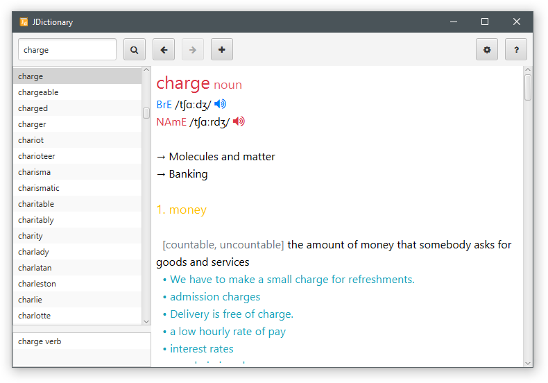
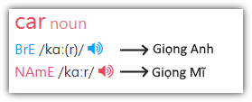
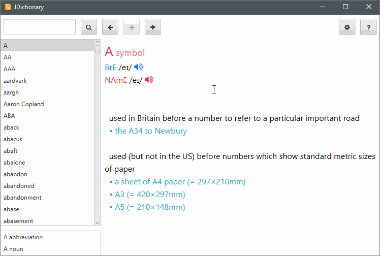
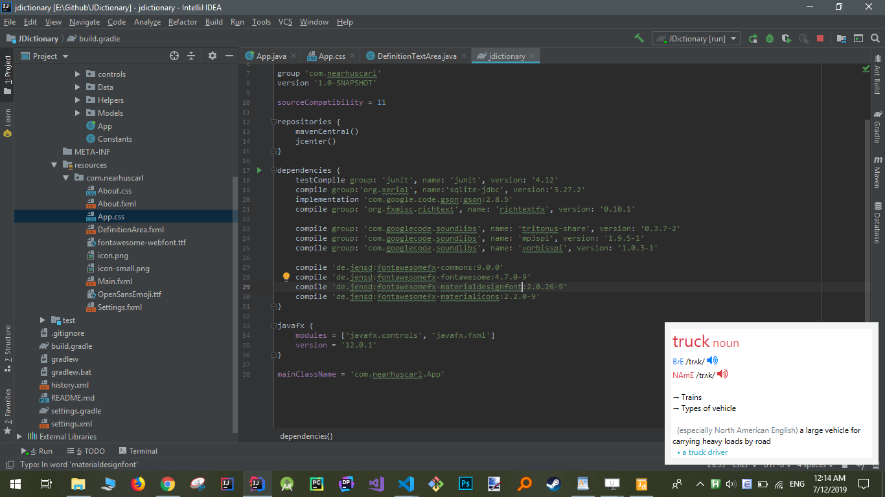
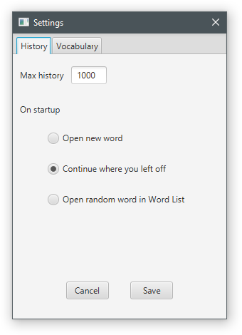
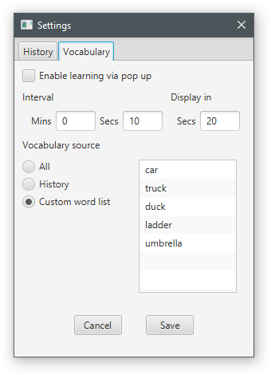
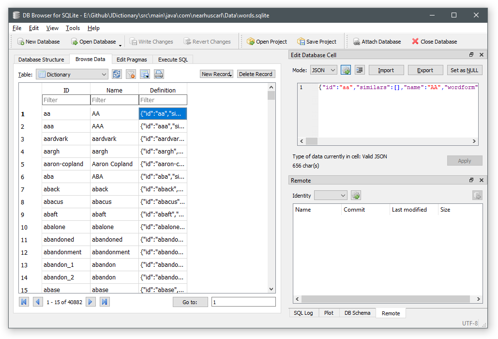

# JDictionary

JDictionary là ứng dụng từ điển Anh-Anh viết bằng JavaFX (được viết lại bằng Java
từ [EDictionary])



## Tính năng chính:

* Tra 40.000 từ tiếng anh khác nhau


* Phát âm giọng Anh và Mĩ



* Lịch sử tra từ


* Xem các wordform khác nhau trong 1 từ


* Tra nhanh từ bằng cách nháy đúp chuột vào từ cần tra



* Gợi ý các từ gần giống khi không có kết quả


* Thêm từ vào danh sách từ vựng cần học


* Hiện popup định nghĩa từ để hỗ trợ học từ vựng sau một khoảng thời gian định trước. Popup có thể tắt nhanh bằng cách nhấn chuột phải



## Các tùy chọn

### Tùy chọn liên quan tới lịch sử



* Max history: Giới hạn số lượng từ tối đa lưu trong lịch sử tra từ. Các từ
cũ hơn sẽ bị lượt bỏ dần

* Khi khởi động:
    * Mở từ mới
    * Mở từ từ lần cuối tra trước khi tắt
    * Mở một từ ngẫu nhiên trong danh sách từ

### Tùy chọn liên quan tới học từ



* Bật/tắt tính năng học từ vựng
* Chọn thời gian giữa mỗi lần hiện popup và thời gian popup hiện
* Nguồn từ để học:
    * Lấy ngẫu nhiên từ tất cả các từ trong từ điển
    * Lấy từ lịch sử tra từ
    * Lấy từ danh sách do người dùng tự chọn

## Cơ sở dữ liệu

### Danh sách từ với định nghĩa được lưu trong SQLite db

#### Schema
```sql
CREATE TABLE Dictionary (
    [ID] NVARCHAR NOT NULL PRIMARY KEY,
    [Name] NVARCHAR,
    [Definition] NVARCHAR)
CREATE INDEX [idxDictionary] ON Dictionary ([ID])
```



### Settings và thông tin lịch sử lưu trong các file XML

Do là file text nên có thể chỉnh sửa settings trực tiếp trong đây

#### History

```xml
<!-- history.xml -->

<?xml version="1.0" encoding="UTF-8" standalone="no"?>
<history>
    <currentIndex>45</currentIndex>
    <collection>
        <word>familiarly</word>
        <word>removal</word>
        <word>spoil</word>
        <word>invariant</word>
        <word>jackdaw</word>
        <word>exotica</word>
        <word>A</word>
        <word>duck</word>
        <word>ladder</word>
        ...
    </collection>
</history>
```

#### Settings

```xml
<!-- settings.xml -->

<?xml version="1.0" encoding="UTF-8" standalone="no"?>
<settings>
    <maxHistory>1000</maxHistory>
    <historyOnStartup>OPEN_WHERE_YOU_LEFT_OFF</historyOnStartup>
    <learningEnabled>false</learningEnabled>
    <minInterval>0</minInterval>
    <secInterval>10</secInterval>
    <vocabularySource>CUSTOM_WORDLIST</vocabularySource>
    <customWordList>
        <word>car</word>
        <word>truck</word>
        <word>duck</word>
        <word>ladder</word>
        <word>umbrella</word>
    </customWordList>
    <secDisplay>20</secDisplay>
</settings>
```

## Thư viện sử dụng

* javafx
* richtextfx
* fontawesomefx
* gson

## Setup project

https://www.youtube.com/watch?v=nKIMGH0l3Wo

[EDictionary]: https://github.com/NearHuscarl/EDictionary